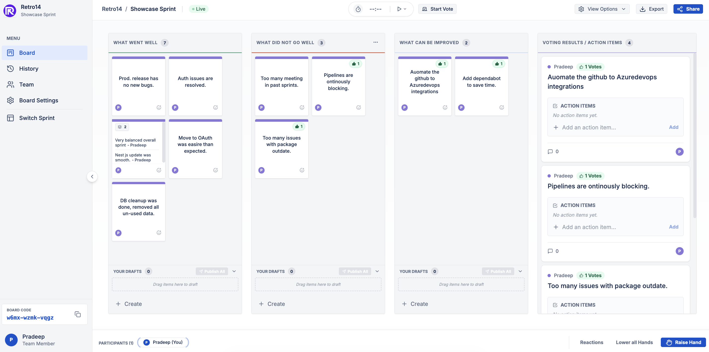

<p align="center">
  <br>
  <b>Retro14</b> &nbsp;·&nbsp; Collaborative retrospective tool for agile teams<br>
  <a href="README.md">Overview</a> &nbsp;·&nbsp;
  <a href="docs/FRONTEND.md">Frontend</a> &nbsp;·&nbsp;
  <a href="docs/BACKEND.md">Backend</a> &nbsp;·&nbsp;
  <a href="docs/DEPLOYMENT.md">Deployment</a> &nbsp;·&nbsp;
  <a href="docs/DOCKER.md">Docker</a> &nbsp;·&nbsp;
  <a href="docs/K8S.md">K8s</a>
</p>

---

A real-time retro board with structured voting, card grouping, shared timers, and PDF export — no account needed to join a session.



## What it does

Create a board, share the code, and your whole team joins from any browser. Cards are drafted privately and published when you're ready, so nobody reads your notes mid-thought. Once everyone's written up, vote on what matters most, group related cards into themes, assign action items, and export the results before you close the tab.

## Stack

- **Frontend** — React 18, TypeScript, Vite, React Router v7
- **Backend** — Supabase (Postgres + Auth + Realtime)
- **Hosting** — Cloudflare Pages
- **Email** — Brevo (SMTP relay for auth emails)

## Getting started

```bash
yarn install
```

Create a `.env` at the project root:

```env
VITE_SUPABASE_URL=https://<project-ref>.supabase.co
VITE_SUPABASE_ANON_KEY=<anon-key>
```

```bash
yarn start
```

No env file? The app runs in demo mode with a local in-memory backend — good enough to poke around the UI.

## Running with Docker

The full stack (Postgres, Auth, Realtime, REST API, frontend) runs locally in Docker — no Supabase Cloud account needed.

```bash
cp .env.docker.example .env.docker
# edit .env.docker — set POSTGRES_PASSWORD at minimum
docker compose --env-file .env.docker up --build
```

App at `http://localhost:3000`, API at `http://localhost:8000`. See [docs/DOCKER.md](docs/DOCKER.md) for dev mode (hot reload) and production JWT setup.

Kubernetes manifests and Helm chart guidance are in [docs/K8S.md](docs/K8S.md).

## Docs

- [Frontend](docs/FRONTEND.md) — project structure, routing, auth flow, board state
- [Backend](docs/BACKEND.md) — database schema, RLS policies, Realtime setup
- [Deployment](docs/DEPLOYMENT.md) — Cloudflare Pages, GitHub Actions CI, Supabase setup, Brevo SMTP
- [Docker](docs/DOCKER.md) — full local stack, dev mode, production JWT keys
- [Kubernetes](docs/K8S.md) — K8s manifests, Supabase Helm chart, TLS, scaling

## License

MIT
